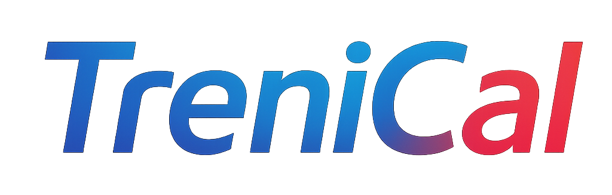

<!-- README template taken by the Best-README-Template project at https://github.com/othneildrew/Best-README-Template -->

<!-- Improved compatibility of back to top link: See: https://github.com/othneildrew/Best-README-Template/pull/73 -->
<a id="readme-top"></a>
<!--
*** Thanks for checking out the Best-README-Template. If you have a suggestion
*** that would make this better, please fork the repo and create a pull request
*** or simply open an issue with the tag "enhancement".
*** Don't forget to give the project a star!
*** Thanks again! Now go create something AMAZING! :D
-->


<!-- PROJECT SHIELDS -->
<!--
*** I'm using markdown "reference style" links for readability.
*** Reference links are enclosed in brackets [ ] instead of parentheses ( ).
*** See the bottom of this document for the declaration of the reference variables
*** for contributors-url, forks-url, etc. This is an optional, concise syntax you may use.
*** https://www.markdownguide.org/basic-syntax/#reference-style-links
-->

<!-- [![Contributors][contributors-shield]][contributors-url] -->
<!-- [![Forks][forks-shield]][forks-url] -->
<!-- [![Stargazers][stars-shield]][stars-url] -->
[![Release][release-shield]][release-url]
[![MIT License][license-shield]][license-url]
[![Issues][issues-shield]][issues-url]
<!-- [![LinkedIn][linkedin-shield]][linkedin-url] -->

<!-- PROJECT LOGO -->
<br />
<div align="center">
  <a href="https://github.com/GiuseppeMonaco/TreniCal">
    
  </a>

<!-- <h3 align="center">TreniCal</h3> -->

  <p align="center">
    Distributed Ticket and Rail Service Management System
    <br />
    <!-- <a href="https://github.com/GiuseppeMonaco/TreniCal"><strong>Explore the docs »</strong></a>
    <br /> -->
    <br />
    <!-- <a href="https://github.com/GiuseppeMonaco/TreniCal">View Demo</a> -->
    <!-- &middot; -->
    <a href="https://github.com/GiuseppeMonaco/TreniCal/issues/new?labels=bug&template=bug-report---.md">Report Bug</a>
    &middot;
    <a href="https://github.com/GiuseppeMonaco/TreniCal/issues/new?labels=enhancement&template=feature-request---.md">Request Feature</a>
  </p>
</div>


<!-- TABLE OF CONTENTS -->
<details>
  <summary>Table of Contents</summary>
  <ol>
    <li>
      <a href="#about-the-project">About The Project</a>
      <!-- <ul>
        <li><a href="#built-with">Built With</a></li>
      </ul> -->
    </li>
    <li>
      <a href="#getting-started">Getting Started</a>
      <ul>
        <li><a href="#prerequisites">Prerequisites</a></li>
        <li><a href="#installation">Installation</a></li>
      </ul>
    </li>
    <li><a href="#usage">Usage</a></li>
    <!-- <li><a href="#roadmap">Roadmap</a></li> -->
    <!-- <li><a href="#contributing">Contributing</a></li> -->
    <li><a href="#license">License</a></li>
    <li><a href="#contact">Contact</a></li>
    <!-- <li><a href="#acknowledgments">Acknowledgments</a></li> -->
  </ol>
</details>

<!-- ABOUT THE PROJECT -->
## About The Project

[![Product Name Screen Shot][product-screenshot]](https://github.com/GiuseppeMonaco/TreniCal)

TreniCal is a client-server application developed in Java for managing train ticket reservations and purchases, with gRPC-based distributed architecture.

### ✨ Main Features
- Trip search with filters by station, date, and train type
- Purchase and booking tickets for multiple passengers
- Promotion system with customized discount codes
- Loyalty program with exclusive benefits
- Push notifications for cancellations, deadlines, and exclusive promotions
- Personal area for ticket and booking management

### 🛠️ Technologies Used
- **Java** - Main language
- **gRPC** - Client-server communication
- **SQLite** - Database with JDBC Driver
- **Logback/SLF4J** - Logging system
- **JUnit 5** - Testing framework
- **Swing** - Graphical interface

<p align="right">(<a href="#readme-top">back to top</a>)</p>


<!--
### Built With

* [![Next][Next.js]][Next-url]
* [![React][React.js]][React-url]
* [![Vue][Vue.js]][Vue-url]
* [![Angular][Angular.io]][Angular-url]
* [![Svelte][Svelte.dev]][Svelte-url]
* [![Laravel][Laravel.com]][Laravel-url]
* [![Bootstrap][Bootstrap.com]][Bootstrap-url]
* [![JQuery][JQuery.com]][JQuery-url]

<p align="right">(<a href="#readme-top">back to top</a>)</p>
-->


<!-- GETTING STARTED -->
## Getting Started

To use this software, get the latest release from the [release page][release-url].

Or to get a local copy up and running follow these simple example steps.

### Prerequisites

- Java 21 - JDK (Java Development Kit) 
  ```sh
  # Check the installed version of Java
  java -version
  javac -version
  ```

### Installation

1. Clone the repo
   ```sh
   git clone https://github.com/GiuseppeMonaco/TreniCal.git
   ```
2. Change git remote url to avoid accidental pushes to base project
   ```sh
   git remote set-url origin github_username/repo_name
   git remote -v # confirm the changes
   ```

<p align="right">(<a href="#readme-top">back to top</a>)</p>


<!-- USAGE EXAMPLES -->
## Usage

### Configuration

The project supports the use of configuration files to customize the behavior of the application without having to modify the source code, both for the client and the server.

#### Server

A configuration file named `TreniCalServerConfig.toml` can be placed in the same folder of the executable file of the server.

Or in the root directory of the project:

```
Trenical/
├── .idea
├── .mvn
├── client
├── common
└── TreniCalServerConfig.toml
```

**Content of `TreniCalServerConfig.toml`**

```toml
server.port = 8008
server.threadNumber = 2

database.path = "./TreniCal.db"

[logic.price]
distanceMultiplier = 0.05
businessMultiplier = 1.3
```

#### Client

A configuration file named `TreniCalClientConfig.toml` can be placed in the same folder of the executable file of the client.

Or in the root directory of the project:

```
Trenical/
├── .idea
├── .mvn
├── client
├── common
└── TreniCalClientConfig.toml
```

**Content of `TreniCalClientConfig.toml`**

```toml
server.address = "localhost"
server.port = 8008
```

<p align="right">(<a href="#readme-top">back to top</a>)</p>


<!-- ROADMAP -->
<!--
## Roadmap

- [ ] Feature 1
- [ ] Feature 2
- [ ] Feature 3
    - [ ] Nested Feature

See the [open issues](https://github.com/GiuseppeMonaco/TreniCal/issues) for a full list of proposed features (and known issues).

<p align="right">(<a href="#readme-top">back to top</a>)</p>
-->

<!-- CONTRIBUTING -->
<!--
## Contributing

Contributions are what make the open source community such an amazing place to learn, inspire, and create. Any contributions you make are **greatly appreciated**.

If you have a suggestion that would make this better, please fork the repo and create a pull request. You can also simply open an issue with the tag "enhancement".
Don't forget to give the project a star! Thanks again!

1. Fork the Project
2. Create your Feature Branch (`git checkout -b feature/AmazingFeature`)
3. Commit your Changes (`git commit -m 'Add some AmazingFeature'`)
4. Push to the Branch (`git push origin feature/AmazingFeature`)
5. Open a Pull Request

<p align="right">(<a href="#readme-top">back to top</a>)</p>


### Top contributors:

<a href="https://github.com/GiuseppeMonaco/TreniCal/graphs/contributors">
  
</a>
-->


<!-- LICENSE -->
## License

Distributed under the MIT License. See `LICENSE.txt` for more information.

<p align="right">(<a href="#readme-top">back to top</a>)</p>


<!-- CONTACT -->
## Contact

Giuseppe Monaco - [@Gius_mo](https://x.com/Gius_mo)

Project Link: [https://github.com/GiuseppeMonaco/TreniCal](https://github.com/GiuseppeMonaco/TreniCal)

<p align="right">(<a href="#readme-top">back to top</a>)</p>


<!-- ACKNOWLEDGMENTS -->
<!--
## Acknowledgments

* []()
* []()
* []()

<p align="right">(<a href="#readme-top">back to top</a>)</p>
-->


<!-- MARKDOWN LINKS & IMAGES -->
<!-- https://www.markdownguide.org/basic-syntax/#reference-style-links -->
[contributors-shield]: https://img.shields.io/github/contributors/GiuseppeMonaco/TreniCal.svg?style=for-the-badge
[contributors-url]: https://github.com/GiuseppeMonaco/TreniCal/graphs/contributors
[forks-shield]: https://img.shields.io/github/forks/GiuseppeMonaco/TreniCal.svg?style=for-the-badge
[forks-url]: https://github.com/GiuseppeMonaco/TreniCal/network/members
[stars-shield]: https://img.shields.io/github/stars/GiuseppeMonaco/TreniCal.svg?style=for-the-badge
[stars-url]: https://github.com/GiuseppeMonaco/TreniCal/stargazers
[issues-shield]: https://img.shields.io/github/issues/GiuseppeMonaco/TreniCal?style=for-the-badge
[issues-url]: https://github.com/GiuseppeMonaco/TreniCal/issues
[license-shield]: https://img.shields.io/github/license/GiuseppeMonaco/TreniCal?style=for-the-badge
[license-url]: https://github.com/GiuseppeMonaco/TreniCal/blob/main/LICENSE.txt
[release-shield]: https://img.shields.io/github/release/GiuseppeMonaco/TreniCal?style=for-the-badge
[release-url]: https://github.com/GiuseppeMonaco/TreniCal/releases
[linkedin-shield]: https://img.shields.io/badge/-LinkedIn-black.svg?style=for-the-badge&logo=linkedin&colorB=555
[linkedin-url]: https://linkedin.com/in/linkedin_username
[product-screenshot]: images/train.jpg
[Next.js]: https://img.shields.io/badge/next.js-000000?style=for-the-badge&logo=nextdotjs&logoColor=white
[Next-url]: https://nextjs.org/
[React.js]: https://img.shields.io/badge/React-20232A?style=for-the-badge&logo=react&logoColor=61DAFB
[React-url]: https://reactjs.org/
[Vue.js]: https://img.shields.io/badge/Vue.js-35495E?style=for-the-badge&logo=vuedotjs&logoColor=4FC08D
[Vue-url]: https://vuejs.org/
[Angular.io]: https://img.shields.io/badge/Angular-DD0031?style=for-the-badge&logo=angular&logoColor=white
[Angular-url]: https://angular.io/
[Svelte.dev]: https://img.shields.io/badge/Svelte-4A4A55?style=for-the-badge&logo=svelte&logoColor=FF3E00
[Svelte-url]: https://svelte.dev/
[Laravel.com]: https://img.shields.io/badge/Laravel-FF2D20?style=for-the-badge&logo=laravel&logoColor=white
[Laravel-url]: https://laravel.com
[Bootstrap.com]: https://img.shields.io/badge/Bootstrap-563D7C?style=for-the-badge&logo=bootstrap&logoColor=white
[Bootstrap-url]: https://getbootstrap.com
[JQuery.com]: https://img.shields.io/badge/jQuery-0769AD?style=for-the-badge&logo=jquery&logoColor=white
[JQuery-url]: https://jquery.com 
